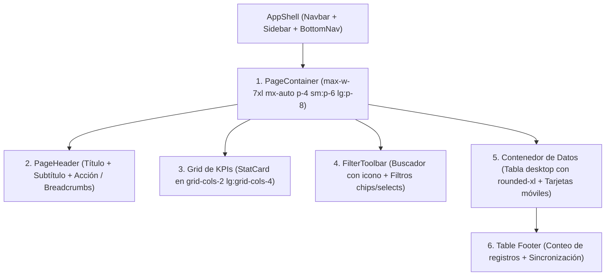

# 🏛️ Guía del Sistema de Diseño y Homogenización de Módulos
**Plataforma Clínica Odontológica — `dentistry/frontend`**

---

## 1. Diagnóstico Inicial y Problemas Resueltos

Al analizar las pantallas existentes, se detectaron discrepancias sustanciales en la disposición y experiencia de usuario:

| Dimensión | Estado Anterior (Discrepancias) | Estado Homogenizado (Estándar Actual) |
| :--- | :--- | :--- |
| **Contenedor de Página** | Mezcla caótica: `p-8 flex flex-col` (fijo sin max-width en Pacientes e Inventario), `max-w-5xl` (Agenda), `p-4 md:p-8` (Pagos). | Unificado con `<PageContainer>`: `w-full max-w-7xl mx-auto p-4 sm:p-6 lg:p-8 flex flex-col gap-6`. |
| **Cabeceras de Módulo** | `Servicios` tenía cabecera (`h1 + descripción + botón`), mientras que `Pacientes`, `Inventario` y `Pagos` saltaban directamente a los números sin título. | Unificado con `<PageHeader>`: Título `font-display text-2xl sm:text-3xl`, descripción clínica, breadcrumbs navegables y slot de acción principal. |
| **Tarjetas de Métricas (KPIs)** | Múltiples formatos: `rounded-[4px]` con etiquetas mono en Pacientes, botones de filtro interactivos en Inventario, tarjetas básicas en Pagos. | Unificado con `<StatCard>`: Reutilizable, con soporte para variantes semánticas (`default`, `success`, `warning`, `danger`, `accent`), modo clickeable (`active`), y diseño uniforme `rounded-xl`. |
| **Barras de Búsqueda y Filtros** | Inputs con `h-9 rounded-[3px]`, SVGs manuales sin estandarizar, selects nativos con radios rectos. | Unificado con `<FilterToolbar>` y `<Input inputSize="sm" leftIcon={<Icons.search />}>`. |
| **Radio de Bordes (Tokens)** | Proliferación de micro-radios arbitrarios (`rounded-[4px]`, `rounded-[3px]`, `rounded-[2px]`). La variable `--radius` no estaba definida en `:root`. | Definición oficial de `--radius: 0.75rem (12px)` en `:root` y `@theme inline`. Erradicación total de radios arbitrarios en favor de `rounded-xl`, `rounded-lg` y `rounded-full`. |
| **Tablas y Estados Vacíos** | Bordes angulares, paginadores inconsistentes, mensajes de "Sin resultados" en texto plano. | Contenedor de datos `rounded-xl overflow-hidden shadow-xs`, cabecera `bg-[var(--background)]/50`, badges de estado (`Badge`) y estado vacío (`EmptyState`). |
| **Listado de Citas (Agenda)** | Excesiva saturación de colores, tarjetas pastel arcoíris, bordes izquierdos estridentes y 4 colores de botones por tarjeta. | **Paleta clínica minimalista:** estados sutiles con transparencias al 10% (`emerald`, `amber`, `stone`, `rose`), eliminación de bordes gruesos de colores, dots discretos, y botones de acción unificados con el tono primario médico (`#3d7a46`). |

---

## 2. Arquitectura Visual de 6 Capas

Cada pantalla de la plataforma ahora responde a una estructura arquitectónica predecible:



---

## 3. Catálogo de Componentes Base Estandarizados

### 3.1 `PageContainer`
*Archivo:* `src/shared/components/layout/PageContainer.tsx`
- **Propósito:** Centrado espacial, limitación responsiva de ancho y espaciado vertical consistente (`gap-6`).
- **Props:**
  - `maxWidth`: `"max-w-7xl"` (vistas maestras de catálogo), `"max-w-4xl"` o `"max-w-2xl"` (formularios de detalle/registro).
  - `children`: Contenido de la pantalla.

### 3.2 `PageHeader`
*Archivo:* `src/shared/components/layout/PageHeader.tsx`
- **Propósito:** Identidad de módulo, contexto operacional y acceso a la acción primaria (`+ Nuevo...`).
- **Props:**
  - `title`: Título principal (`string`).
  - `description`?: Resumen descriptivo de la vista (`string`).
  - `action`?: Componente de botón de acción (`ReactNode`).
  - `breadcrumbs`?: Array de migas de pan para subvistas (`{ label, onClick }[]`).
  - `badge`?: Chip complementario opcional (`ReactNode`).

### 3.3 `StatCard`
*Archivo:* `src/shared/components/ui/StatCard.tsx`
- **Propósito:** Presentación de indicadores clínicos y financieros de alto nivel.
- **Props:**
  - `label`: Etiqueta en mayúsculas (`text-[10px] sm:text-[11px] font-mono tracking-wider text-[var(--muted)]`).
  - `value`: Métrica numérica o formateada (`font-display font-bold text-2xl sm:text-3xl`).
  - `sublabel`?: Detalle contextual o período de cálculo.
  - `variant`: `"default"` | `"success"` | `"warning"` | `"danger"` | `"accent"`.
  - `icon`?: Icono representativo.
  - `onClick`?: Función para convertir la tarjeta en un filtro interactivo.
  - `active`?: Booleano que activa el resaltado de selección.

### 3.4 `FilterToolbar`
*Archivo:* `src/shared/components/layout/FilterToolbar.tsx`
- **Propósito:** Barra unificada para controles de búsqueda, filtros por categoría/estado y contadores de resultados.

---

## 4. Auditoría de Módulos Refactorizados

Todos los módulos del directorio `src/modules/clinic/views/` fueron actualizados:

```
src/modules/clinic/views/
├── Patients.tsx           ← Homogenizado con PageContainer, PageHeader, 3 StatCards, FilterToolbar y tabla rounded-xl.
├── Services.tsx           ← Homogenizado con PageContainer, PageHeader, 4 StatCards, FilterToolbar y category pills.
├── Inventory.tsx          ← Homogenizado con PageHeader, 4 StatCards interactivos filtrables y tablas por categoría.
├── Payments.tsx           ← Homogenizado con PageHeader, 4 StatCards, FilterToolbar de fechas/métodos y tabla rounded-xl.
├── Treatments.tsx         ← Homogenizado con PageHeader, 4 StatCards y navegación a catálogo de servicios.
├── ClinicDashboard.tsx    ← Homogenizado con PageContainer, PageHeader, StatCards y acciones rápidas rounded-xl.
├── Agenda.tsx             ← Homogenizado ancho max-w-7xl, padding responsivo y paleta minimalista sin estridencias.
├── CreatePatient.tsx      ← Homogenizado con PageContainer max-w-4xl, PageHeader con breadcrumbs y campos rounded-lg.
├── CreateAppointment.tsx  ← Homogenizado con PageContainer max-w-4xl, PageHeader con breadcrumbs y formularios unificados.
├── PatientDetail.tsx      ← Eliminados todos los micro-radios, integrado PageContainer y botones estandarizados.
├── AppointmentDetail.tsx  ← Eliminado texto duplicado, integrado PageContainer max-w-4xl y estados limpios.
└── RegisterPayment.tsx    ← Homogenizado con PageContainer max-w-2xl, PageHeader y botones de acción unificados.
```

---

## 5. Plantilla Oficial para Nuevos Módulos

Cualquier nuevo módulo en la plataforma debe crearse replicando esta estructura:

```tsx
"use client";

import { useState } from "react";
import { PageContainer, PageHeader, FilterToolbar } from "@/shared/components/layout";
import { StatCard, Button, Input, Badge, EmptyState, Icons } from "@/shared/components/ui";

export default function NuevoModuloView() {
  const [search, setSearch] = useState("");

  return (
    <PageContainer>
      {/* 1. Cabecera */}
      <PageHeader
        title="Título del Módulo"
        description="Descripción operativa del propósito del módulo"
        action={
          <Button variant="primary" onClick={() => {}} className="font-semibold text-xs shadow-xs">
            <span className="text-base leading-none font-bold">+</span>
            Nueva Entidad
          </Button>
        }
      />

      {/* 2. KPIs y Métricas */}
      <div className="grid grid-cols-2 lg:grid-cols-4 gap-3.5">
        <StatCard label="Total" value={100} sublabel="Registros activos" />
        <StatCard label="Completados" value={85} sublabel="Concluidos" variant="success" />
        <StatCard label="Pendientes" value={15} sublabel="En espera" variant="warning" />
        <StatCard label="Monto Estimado" value="S/ 4,500.00" sublabel="Facturación" variant="accent" />
      </div>

      {/* 3. Filtros y Búsqueda */}
      <FilterToolbar>
        <div className="relative flex-1 max-w-md">
          <Input
            inputSize="sm"
            leftIcon={Icons.search}
            placeholder="Buscar registros..."
            value={search}
            onChange={(e) => setSearch(e.target.value)}
          />
        </div>
      </FilterToolbar>

      {/* 4. Tabla de Datos */}
      <div className="bg-[var(--surface)] border border-[var(--border)] rounded-xl overflow-hidden shadow-xs">
        <div className="overflow-x-auto">
          <table className="w-full text-left">
            <thead>
              <tr className="border-b border-[var(--border)] bg-[var(--background)]/50">
                <th className="px-4 py-3 text-[11px] font-mono uppercase tracking-wider text-[var(--muted)]">
                  Elemento
                </th>
                <th className="px-4 py-3 text-[11px] font-mono uppercase tracking-wider text-[var(--muted)]">
                  Estado
                </th>
              </tr>
            </thead>
            <tbody className="divide-y divide-[var(--border)]">
              {/* Filas con hover:bg-[var(--background)]/60 */}
            </tbody>
          </table>
        </div>
      </div>
    </PageContainer>
  );
}
```

---

## 6. Verificación de Compilación y Salud del Código

- **Frontend (`dentistry/frontend`):** `next build` compila las 13 rutas estáticas con **0 errores**.
- **Backend (`dentistry/backend`):** `nest build` compila con **0 errores**, resolviendo la sincronización del repositorio de pacientes con el ORM.
- **Documento de Lineamientos:** Publicado en `dentistry/frontend/DESIGN_SYSTEM_GUIDELINES.md`.
